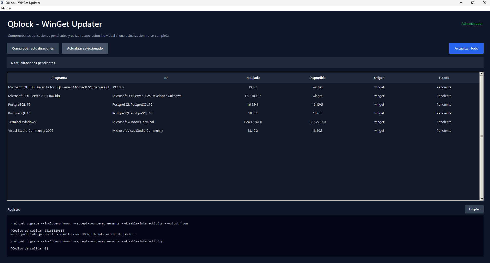

# WinGet Updater

A Windows desktop application that helps developers check for and update
installed applications using WinGet, Windows' native package manager.



## 📥 Download & Verification

To download the latest stable version and verify its integrity:

1. Go to the **[Releases](../../releases)** section on the right side of this repository.
2. Download the `WingetUpdater.exe` executable and the accompanying `checksums.txt`.
3. Open **PowerShell** in your downloads folder and verify that the executable code hasn't been modified by running:
   ```powershell
   Get-FileHash .\WingetUpdater.exe -Algorithm SHA256
   ```
4. Compare the generated hash string with the one inside `checksums.txt` or listed directly on the Release description page.

## Features

- Checks for available updates when the application starts.
- Lists applications, package IDs, installed and available versions, sources,
  and the status of each operation.
- Lets you update a selected package or run a general upgrade.
- After a general upgrade, checks again for packages that are still pending
  and, if any remain, attempts to upgrade them individually using each
  package's exact ID. These individual operations may be interactive.
- Displays a log of executed commands, their output, and exit codes.
- Requests elevation through UAC and runs with administrator privileges.
- Starts in Spanish or English according to the Windows display language;
  the **Language / Idioma** menu lets you switch immediately.

The application first retrieves the list of available upgrades using WinGet's
JSON output. If that output cannot be parsed, it tries to read the text output
instead. Individual recovery is generic and is not limited to a particular
application or publisher.
The interface language is selected at startup from the Windows display
language (Spanish when available, English otherwise) and can be changed while
the application is open. A manual language choice applies to the current run;
the next launch again follows the Windows display language.

## Requirements

- Windows 10 or 11.
- Python 3.10 or later to run the source code.
- WinGet available on Windows.
- Python and `pip` to build the executable. `build.bat` installs PyInstaller
  if it is not already installed.

The application uses Python standard-library modules, including Tkinter for
the graphical interface. No additional Python dependency file is required.
WinGet is an external tool and must be available on the system.

## Run from source

From PowerShell, in the project folder:

```powershell
py WingetUpdater.py
```

Windows may display a User Account Control (UAC) prompt to authorize the
administrator privileges required for update operations. If WinGet is not
available, the application cannot check for or install package updates.

## Build the Windows executable

Run `build.bat` from the project folder. The script:

1. Removes the `dist` and `build` folders and any previous PyInstaller
   specification file.
2. Checks whether PyInstaller is installed and installs it with `pip` if
   necessary.
3. Builds `WingetUpdater.py` as a single-file executable without a console
   window, including `icono.ico` and `admin.manifest`.
4. The manifest requests administrator privileges. If the build succeeds,
   the script copies `WingetUpdater.exe` to the project folder.

To build the application, `build.bat`, `WingetUpdater.py`, `icono.ico`, and
`admin.manifest` must be in the project folder. An Internet connection is
required if PyInstaller needs to be downloaded.

## Scope and disclaimer

The application invokes WinGet; it does not replace WinGet or control the
behavior of third-party installers. The availability, compatibility, and
outcome of each update depend on WinGet, the package source, and the installer
itself. Review interactive operations and WinGet messages. Use this
application at your own risk.

See [LICENSE.md](LICENSE.md) for the license terms and disclaimer.
